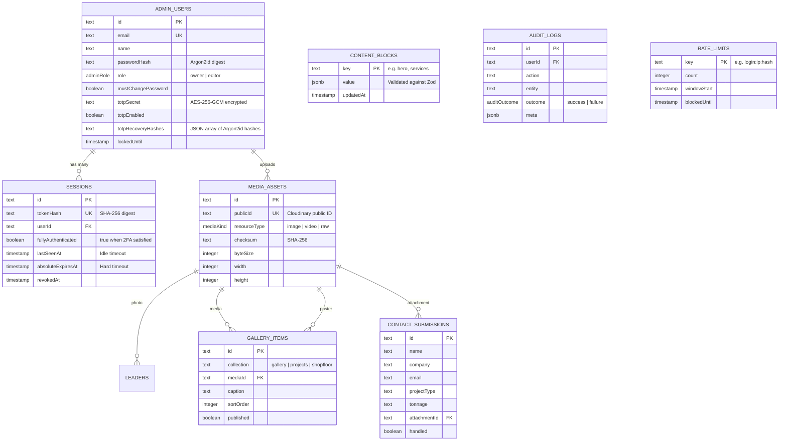

# Caldim Engineering — Comprehensive System & Architecture Guide

> **Document Purpose**: This document provides an exhaustive, end-to-end technical breakdown of the **Caldim Engineering** web application. It is designed for software engineers, architects, and AI reasoning models (such as Claude) to immediately understand the system's purpose, design patterns, security controls, data architecture, frontend 3D/animation pipeline, and deployment lifecycles without having to reverse-engineer the codebase.

---

## Table of Contents
1. [Executive Summary & Domain Context](#1-executive-summary--domain-context)
2. [High-Level Architecture & Tech Stack](#2-high-level-architecture--tech-stack)
3. [Core Architectural Principles](#3-core-architectural-principles)
4. [Data Layer & Content Resolution Pipeline](#4-data-layer--content-resolution-pipeline)
5. [Enterprise Security Architecture](#5-enterprise-security-architecture)
6. [Frontend & Interactive 3D WebGL Pipeline](#6-frontend--interactive-3d-webgl-pipeline)
7. [Admin Panel & Content Management System](#7-admin-panel--content-management-system)
8. [API Endpoints & Request Lifecycles](#8-api-endpoints--request-lifecycles)
9. [Complete Directory & File Map](#9-complete-directory--file-map)
10. [Environment Variables & Configuration](#10-environment-variables--configuration)
11. [CLI Tooling & Operational Runbooks](#11-cli-tooling--operational-runbooks)
12. [Gotchas, Edge Cases & Developer Conventions](#12-gotchas-edge-cases--developer-conventions)

---

## 1. Executive Summary & Domain Context

**Caldim Engineering Services** is a high-performance structural engineering and steel detailing consultancy specializing in:
- Structural Steel Detailing (commercial, industrial, infrastructure)
- Connection Design with Professional Engineer (PE) stamping across all 50 US states
- Joist & Deck Detailing
- Pre-bid & Construction Estimation

The web application is a dual-purpose platform:
1. **Public Showcase**: An interactive, visually stunning, high-performance web experience demonstrating precision engineering through 3D WebGL structural assembly models, interactive exploded connection viewers, and dynamic theme switching.
2. **Self-Contained Headless Admin System**: An integrated management suite (`/admin`) allowing authorized personnel to modify homepage content blocks, curate photo/video galleries, update leadership rosters, review incoming RFQ (Request for Quote) submissions, and monitor audit trails — backed by enterprise-grade cryptographic security.

---

## 2. High-Level Architecture & Tech Stack

```mermaid
graph TD
    Client[Web Browser Client] -->|HTTPS + CSP Nonce + Double-Submit CSRF| EdgeMiddleware[Next.js Edge Middleware]
    
    subgraph Routing & Runtimes
        EdgeMiddleware -->|Static Assets / Non-Admin| ServerComponents[React Server Components (Node.js)]
        EdgeMiddleware -->|Admin Routes| AdminGuard[Admin Session Gate]
        AdminGuard --> ServerComponents
    end

    subgraph Content Resolution
        ServerComponents --> GetContent[getSiteContent()]
        GetContent -->|1. Try Read Overrides| SupabaseDB[(Supabase Postgres)]
        GetContent -->|2. Fallback / Merge| ShippedDefaults[lib/content/defaults.ts]
    end

    subgraph Media Pipeline
        Client -->|Direct Video Upload via Short-lived Signature| CloudinaryCDN[Cloudinary CDN]
        Client -->|Image Upload via Next API Route| SharpOptimizer[Server-side Sharp (Re-encode & Strip EXIF)]
        SharpOptimizer --> CloudinaryCDN
    end

    subgraph 3D / Motion Frontend
        ServerComponents --> ClientIslands[Client Hydration Islands]
        ClientIslands --> ThreeJS[Three.js / React Three Fiber / Drei]
        ClientIslands --> GSAP[GSAP + ScrollTrigger + Lenis Smooth Scroll]
    end
```

### Technology Matrix

| Layer | Technology | Rationale / Implementation |
|---|---|---|
| **Framework** | Next.js 14 (App Router) | React Server Components for zero-bundle data fetching; Edge middleware for headers. |
| **Language** | TypeScript 5 (Strict mode) | Strict type safety across database schemas, API contracts, and component props. |
| **Database** | PostgreSQL (Supabase) | Hosted Postgres accessed via connection pooling (Supavisor) and direct DDL connections. |
| **ORM & Querying** | Drizzle ORM + `postgres-js` | Type-safe SQL, zero overhead, prepared statements disabled (`prepare: false`) for transaction pooling. |
| **Media & CDN** | Cloudinary + `sharp` | Images re-encoded server-side to WebP (stripping GPS/EXIF); videos uploaded directly via signed URLs. |
| **3D & WebGL** | Three.js, `@react-three/fiber`, `@react-three/drei` | Code-split procedural CAD/steel scenes with graceful non-WebGL fallbacks. |
| **Animation** | GSAP 3, ScrollTrigger, Lenis, Framer Motion | Smooth interpolation, kinetic scrolling, layout transitions. |
| **Styling** | Tailwind CSS + CSS Variables | Fully tokenized dark/light modes using CSS variables (`--bg`, `--fg`, `--steel`, etc.). |
| **Auth & Crypto** | `@node-rs/argon2`, `otplib`, `jose`, Native `node:crypto` | Argon2id password hashing, AES-256-GCM encryption for TOTP secrets, opaque session tokens. |
| **Validation** | Zod (`zod@3`) | Bidirectional validation: validating inputs on write and stored records on read. |

---

## 3. Core Architectural Principles

### 1. Zero-Config Shipped Defaults (Resilient Degradation)
Unlike typical database-driven websites that crash with a 500 error on a fresh clone or database outage, Caldim Engineering is designed to boot **without a database configured**.
- The entire site’s initial copy, statistics, testimonials, and placeholder leaders are defined in `lib/content/defaults.ts`.
- The database merely holds **runtime overrides** in the `content_blocks` table.
- If `DATABASE_URL` is unset or unreachable, the system catches the error, logs a clean notice, and transparently serves the shipped defaults.
- A corrupted database row degrades only the affected section to its shipped default rather than breaking the page.

### 2. Sections Take Content as Props
No homepage section component imports content from a static file or calls the database directly.
- The root server component (`app/page.tsx`) queries `getSiteContent()` and passes typed slices (e.g., `hero`, `services`, `leaders`) down to sections.
- This pattern isolates components for testing, facilitates instant revalidation (`revalidatePath("/")`), and avoids coupling UI rendering to database querying.

### 3. Server-Only Execution Safeguards
Database clients, cryptographic operations, session management, and Cloudinary secrets are protected with `import "server-only";`. Any accidental import into client-side code causes an immediate build failure.

### 4. Zero Hardcoded Hex Colors
All component styling relies on Tailwind utilities backed by semantic CSS custom properties defined in `app/globals.css` (e.g., `hsl(var(--steel))`). This guarantees that both Dark and Light themes render with appropriate contrast and color balance without visual artifacts.

---

## 4. Data Layer & Content Resolution Pipeline

### Supabase Connection Strategy

Supabase provides two distinct connection endpoints:
1. **Pooled Connection (`DATABASE_URL`, Port 6543 - Supavisor)**:
   - Used by the Next.js runtime.
   - Next.js server actions and route handlers spawn many ephemeral contexts; pooling prevents Postgres connection slot exhaustion.
   - Configured with `prepare: false` in `postgres-js` because Supavisor runs in transaction pooling mode, where prepared statement names leak between clients and cause collision errors.
2. **Direct Connection (`DIRECT_DATABASE_URL`, Port 5432)**:
   - Used exclusively by DDL migrations (`scripts/migrate.mjs`).
   - Advisory locks and schema alterations require dedicated, non-multiplexed session state.

### Drizzle Schema Overview (`lib/db/schema.ts`)



---

## 5. Enterprise Security Architecture

The application implements defense-in-depth security matching financial and enterprise standards:

### 1. Password Protection & Anti-Enumeration
- **Hashing**: Argon2id via `@node-rs/argon2` configured with OWASP profile (19 MiB RAM, 2 iterations, 1 parallelism thread).
- **Anti-Enumeration Constant Timing**: If a user attempts to log in with a non-existent email, the server hashes against a pre-computed dummy digest. Login timing is indistinguishable between valid and invalid emails.
- **Account Lockout**: After 5 consecutive failed attempts, the account is locked for 15 minutes.
- **Password Policy**: NIST SP 800-63B compliant (minimum 12 characters, dictionary blacklist, personal attribute exclusion; no arbitrary symbol rules).

### 2. Multi-Factor Authentication (TOTP)
- Implements RFC 6238 via `otplib`.
- **Encryption at Rest**: The 20-byte base32 TOTP secret is encrypted using **AES-256-GCM** using `APP_ENCRYPTION_KEY`. A stolen database dump yields un-usable ciphertext.
- **Two-Phase Enrolment**: A secret is saved in pending state until verified by a live code from the authenticator app.
- **Single-Use Recovery Codes**: 10 codes generated on enrollment, stored only as **Argon2id hashes**. Using a recovery code automatically revokes all other active sessions for that account.

### 3. Session Management
- **Opaque Tokens**: Generated via 256 bits of cryptographically secure randomness (`crypto.randomBytes(32)`).
- **Zero Raw Storage**: Only the **SHA-256 hash** of the token is saved in the database.
- **Cookie Security**:
  - Production uses `__Host-caldim_session`.
  - Properties: `HttpOnly`, `Secure`, `SameSite=Lax`, `Path=/`.
  - Prefix `__Host-` prevents subdomain spoofing / cookie-jar tossing.
- **Dual Expiration Timers**:
  - *Idle Timeout*: 60 minutes (refreshed on each privileged request).
  - *Absolute Timeout*: 12 hours (hard ceiling, cannot be extended).
- **Session Revocation**: Password updates or security resets instantly invalidate all existing session records in Postgres.

### 4. CSRF Defense
- **Strict Origin Checking**: Enforces `Sec-Fetch-Site: same-origin` and verifies the `Origin` header against `SITE_URL`.
- **Double-Submit Cookie Pattern**: Middleware generates a cryptographically random token in `caldim_csrf` (or `__Host-caldim_csrf`). Client-side stateful requests must supply this in the `x-caldim-csrf` header via `createApiClient()`.

### 5. Content Security Policy (CSP) & Headers (`middleware.ts`)
- **Per-Request Nonce**: Dynamically generated nonce stamped into script tags; disables `'unsafe-inline'` for scripts while permitting Next.js runtime hydration via `'strict-dynamic'`.
- **Host Segregation**:
  - `res.cloudinary.com` is restricted to `img-src` and `media-src`.
  - `api.cloudinary.com` is restricted to `connect-src` (for direct video uploads).
- **Strict Security Headers**: `X-Frame-Options: DENY`, `X-Content-Type-Options: nosniff`, `Referrer-Policy: strict-origin-when-cross-origin`, `Origin-Agent-Cluster: ?1`, strict `Permissions-Policy` (disables mic, camera, usb, geolocation).

### 6. Media Sanitization & Upload Pipeline
- **Magic-Byte Sniffing**: Inspects the leading binary buffer (via `file-type`) rather than trusting file extensions or MIME headers.
- **Image Transcoding**: All image uploads are decoded and re-encoded using `sharp` into WebP. This permanently strips EXIF metadata (preventing GPS coordinate leakage) and neutralizes steganographic payloads.
- **Direct Video Uploading**: Large video files are signed server-side and uploaded directly from the browser to Cloudinary, preventing server memory spikes or route handler timeouts.

---

## 6. Frontend & Interactive 3D WebGL Pipeline

```
components/
├── intro/
│   └── SteelIntro.tsx        # Split dark/light hero title sequence with live assembly
├── hero/
│   ├── Hero.tsx              # Primary hero section with dynamic connection viewer
│   └── HeroScene.tsx         # R3F canvas hosting steel connection elements
├── three/
│   ├── SteelAssemblyScene.tsx # Full procedural 3D warehouse / frame assembly (R3F)
│   ├── ConnectionScene.tsx    # Detailed moment connection CAD simulation
│   ├── ExplodedConnectionViewer.tsx # Interactive slider separating bolts, plates, beams
│   ├── BeforeAfterSlider.tsx  # 2D/3D comparison interactive slider
│   └── useWebGL.ts           # Capability detector & hardware fallback manager
```

### Key 3D & Animation Subsystems:
1. **Procedural Geometry**:
   - Steel columns, W-beams, baseplates, gussets, and bolt clusters are constructed directly via Three.js primitives rather than heavy `.gltf` assets, keeping bundle size small.
2. **`useWebGL()` Hardware Sniffer**:
   - Tests for WebGL context creation, checks for reduced-motion media queries (`prefers-reduced-motion: reduce`), and identifies low-end mobile GPUs.
   - If WebGL is unavailable or disabled, components transparently swap to CSS/SVG static artwork.
3. **Split Dark/Light 3D Title Sequence (`SteelIntro.tsx`)**:
   - Renders a synchronized split view where one half is a dark shop floor and the other half is a bright studio environment, assembling beams and tightening bolts in real time.
4. **GSAP + Lenis Smooth Scrolling**:
   - `SmoothScroll.tsx` coordinates Lenis smooth scrolling with GSAP ScrollTrigger to prevent jitter and maintain keyboard/screen-reader accessibility.

---

## 7. Admin Panel & Content Management System

The admin panel (`/admin`) is a customized, zero-dependency control panel accessible only to authenticated operators.

### Admin Screens:
1. **Overview (`/admin`)**: Summary metrics, count of pending RFQs, recent system activity, and security alert status.
2. **Site Content (`/admin/content`)**: Visual editor for all homepage copy (Hero, Services, Projects, Testimonials, Process, Certifications, Offices). Writes JSON schemas directly to `content_blocks` and invalidates Next.js cache.
3. **Leadership Roster (`/admin/leadership`)**: Interface to add, sort, update bios, and assign portrait images to team leadership.
4. **Media Library (`/admin/media`)**: Visual gallery of Cloudinary assets with search, alt-text editing, format details, and upload widgets.
5. **Slot Curation (`/admin/gallery`)**: Assigns assets from the media library to specific homepage slots (e.g., project gallery, shop floor reel).
6. **Enquiries / RFQ Inbox (`/admin/enquiries`)**: Review submitted requests for quotes, company tonnage specs, and downloaded client blueprints.
7. **Security & Devices (`/admin/security`)**: Password rotation, 2FA TOTP setup, single-use recovery code generation, and active device session management.
8. **Audit Trail (`/admin/activity`)**: Immutable log of every privileged mutation.

---

## 8. API Endpoints & Request Lifecycles

### Authentication Endpoints
- `POST /api/auth/login`: Authenticates email/password against Argon2id; returns 2FA challenge requirement or creates session.
- `POST /api/auth/logout`: Revokes active session in database and clears session cookies.
- `POST /api/auth/password`: Authenticated password change endpoint; revokes all other sessions.
- `POST /api/auth/totp`: Enrolls or disables TOTP; verifies codes; generates recovery keys.
- `GET /api/auth/sessions`: Lists active sessions; `DELETE /api/auth/sessions?id=...` revokes individual sessions.

### Content & Admin Endpoints
- `PUT /api/admin/content`: Updates content block identified by key (validates against Zod schema, updates `content_blocks`, calls `revalidatePath("/")`).
- `GET / POST / PUT / DELETE /api/admin/leaders`: Full CRUD and sorting for leadership profiles.
- `GET / POST / PUT / DELETE /api/admin/gallery`: Manage collections, slot assignments, and display ordering.
- `GET / POST / DELETE /api/admin/media`: Search media, trigger server-side re-encoding, and delete assets from Cloudinary.

### Public Endpoints
- `POST /api/contact`: Accepts public RFQ forms with file attachments; rate-limited; records entry in `contact_submissions` and dispatches optional email alerts via Resend.

---

## 9. Complete Directory & File Map

```
caldim-engineering/
├── app/                           # Next.js App Router root (routing layer only)
│   ├── layout.tsx                 # Root layout: font loading, theme script, CSRF provider
│   ├── page.tsx                   # Main public landing page (Server Component)
│   ├── globals.css                # CSS variables (HSL tokens for dark/light modes)
│   ├── middleware.ts              # Edge security: Nonce, CSP, Cookie prefixing, Admin gate
│   ├── admin/                     # Protected admin routes (/admin/*)
│   │   ├── layout.tsx             # Server-side auth verification and AdminShell wrapper
│   │   ├── page.tsx               # Admin dashboard overview
│   │   ├── content/               # Content block editors
│   │   ├── leadership/            # Leadership team management
│   │   ├── media/                 # Cloudinary media library
│   │   ├── gallery/               # Slot/showcase curation
│   │   ├── enquiries/             # RFQ submissions inbox
│   │   ├── security/              # 2FA & Password settings
│   │   ├── activity/              # Audit trail log viewer
│   │   └── login/                 # Login & 2FA challenge forms
│   └── api/                       # Route handlers (REST endpoints)
│       ├── admin/                 # Content, leader, gallery, and media endpoints
│       ├── auth/                  # Login, logout, session, totp, password routes
│       └── contact/               # Public RFQ ingestion
├── frontend/                      # Client-facing code & UI
│   ├── components/                # Reusable React components
│   │   ├── Nav.tsx                # Fixed top navigation with smooth-scroll anchors
│   │   ├── CsrfProvider.tsx       # Client context providing CSRF header client
│   │   ├── ThemeToggle.tsx        # Light/Dark mode switcher
│   │   ├── SmoothScroll.tsx       # Lenis smooth-scrolling wrapper
│   │   ├── sections/              # Homepage sections (Hero, Services, Projects, etc.)
│   │   ├── intro/                 # SteelIntro 3D opening sequence
│   │   ├── three/                 # Three.js / R3F canvases and shaders
│   │   └── admin/                 # Admin UI forms, data tables, and editors
│   └── hooks/                     # Client hooks
│       └── useTheme.ts            # Client theme state hook
├── backend/                       # Server-only logic, data access & security
│   ├── env.ts                     # Environment variable validation & fallback generator
│   ├── content/                   # Shipped defaults and content resolution logic
│   │   ├── defaults.ts            # Complete default text, projects, and leaders
│   │   └── getSiteContent.ts      # Merges database overrides onto defaults
│   ├── db/                        # Database layer
│   │   ├── index.ts               # postgres-js pooler initialization & proxy (prepare: false)
│   │   └── schema.ts              # Drizzle ORM schema definitions
│   ├── media/                     # Cloudinary integration
│   │   └── cloudinary.ts          # Upload signatures, CDN delivery URLs, deletions
│   └── security/                  # Cryptography & security utilities
│       ├── audit.ts               # Audit logger
│       ├── crypto.ts              # AES-256-GCM encryption for TOTP
│       ├── csrf.ts                # Double-submit CSRF verification
│       ├── guard.ts               # Route handler wrapper enforcing auth & rate limits
│       ├── password.ts            # Argon2id hashing & NIST policy checks
│       ├── rateLimit.ts           # Postgres-backed rate limiting
│       ├── requireAdmin.ts        # Server-side session validator
│       ├── session.ts             # Session lifecycle, token hashing, cookie management
│       ├── totp.ts                # TOTP generation, validation, recovery code logic
│       ├── upload.ts              # Magic-byte check, image normalization via Sharp
│       └── validation.ts          # Zod validation schemas for all inputs
├── shared/                        # Shared types and constants
│   ├── content/                   # Shared content definitions
│   │   └── types.ts               # Content TypeScript definitions
│   └── data/                      # Shared static data & specifications
│       ├── content.ts             # Service, pillar, and team reference data
│       └── softwareLogos.ts       # Software vendor logo references
├── drizzle/                       # Generated SQL migrations
├── scripts/                       # Operational maintenance tools
│   ├── doctor.mjs                 # Diagnostic preflight check
│   ├── migrate.mjs                # Supabase schema migrator
│   ├── seed.mjs                   # First-run admin account creator
│   └── reset-admin.mjs            # CLI password & 2FA recovery tool
├── .env.example                   # Environment variable template
├── drizzle.config.ts              # Drizzle CLI configuration
├── next.config.mjs                # Next.js build and bundle configuration
├── tailwind.config.ts             # Tailwind design token configuration
└── tsconfig.json                  # TypeScript compiler settings & path aliases
```

---

## 10. Environment Variables & Configuration

Configuration is managed via `.env` and validated at startup by `lib/env.ts`.

| Variable | Required? | Default / Fallback | Description |
|---|---|---|---|
| `SITE_URL` | Optional | `http://localhost:3000` | Canonical public origin (used for CSRF matching and cookie domain checks). |
| `DATABASE_URL` | Required for admin | `""` (Uses defaults) | Supabase pooled connection string (`port 6543`, `prepare: false`). |
| `DIRECT_DATABASE_URL`| Required for migration| Fallback to `DATABASE_URL` | Supabase direct connection string (`port 5432`) for running DDL migrations. |
| `DATABASE_SSL` | Optional | `true` (`false` in dev) | Enforce TLS over database connections. |
| `CLOUDINARY_CLOUD_NAME`| Required for media | `""` | Cloudinary cloud identifier. |
| `CLOUDINARY_API_KEY` | Required for media | `""` | Cloudinary API key. |
| `CLOUDINARY_API_SECRET`| Required for media | `""` | Cloudinary secret key (kept strictly server-side). |
| `SESSION_SECRET` | Production | Ephemeral in dev | 32-byte base64 secret used for signing session cookies and CSRF tokens. |
| `APP_ENCRYPTION_KEY` | Production | Ephemeral in dev | 32-byte base64 key used for AES-256-GCM encryption of TOTP secrets. |
| `IP_HASH_SALT` | Production | Ephemeral in dev | Salt used when hashing client IP addresses for audit logging. |
| `REQUIRE_TOTP` | Optional | `false` | Force all admin users to enroll in 2FA before accessing the dashboard. |
| `SECURE_COOKIES` | Optional | `true` in prod | Set `false` only if running behind non-HTTPS local reverse proxy. |

---

## 11. CLI Tooling & Operational Runbooks

### 1. Environment Diagnostic Preflight
```bash
npm run doctor
```
Checks:
- Node.js version (requires `>= 22.5.0`)
- Presence of `.env` and cryptographic secrets
- Migration folder status
- Cloudinary configuration
- Database connectivity & admin account presence

### 2. Database Migration & Provisioning
```bash
npm run db:migrate   # Applies SQL migrations to Supabase via direct port 5432
npm run db:seed      # Creates default admin user and outputs one-time initial password
```

### 3. Emergency Admin Recovery
If locked out or 2FA credentials are lost:
```bash
npm run admin:reset -- admin@caldimengg.com --clear-2fa
```
This resets the user account password and removes enrolled TOTP secrets directly from the terminal.

---

## 12. Gotchas, Edge Cases & Developer Conventions

1. **Transaction Pooling vs Prepared Statements**:
   - Never remove `prepare: false` from `lib/db/index.ts`. In transaction pooling (Supavisor), prepared statements result in runtime query crashes.
2. **Double-Submit CSRF on Mutations**:
   - Direct `fetch()` calls to mutating API routes (`POST`, `PUT`, `DELETE`) will fail with `403 Forbidden` unless the `x-caldim-csrf` header is attached. Always import and use `createApiClient` from `components/CsrfProvider`.
3. **PowerShell Script Execution on Windows**:
   - On Windows environments with restricted PowerShell execution policies, invoke `cmd /c npm run <command>` or `npm.cmd <command>` to prevent script authorization errors.
4. **Zero-Database Local Development**:
   - The public site renders in full fidelity even if `DATABASE_URL` is empty. Do not attempt to add null assertions or break the fallback mechanism in `lib/content/getSiteContent.ts`.
5. **Strict CSP & Inline Scripts**:
   - Do not use arbitrary inline `<script>` tags in layout or pages. Any necessary script must receive the nonce passed down through request headers from `middleware.ts`.
